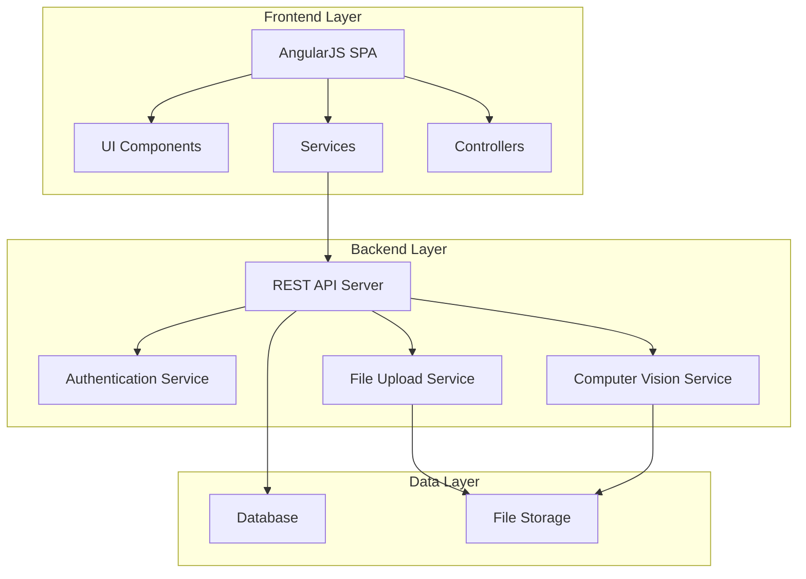

# Design Document

## Overview

The Poker Tracker application is a single-page AngularJS web application that enables poker players to track their session performance through automated chip counting and comprehensive session management. The system integrates computer vision for automatic chip detection and counting, provides role-based access for admin functions, and maintains a real-time leaderboard of player winnings.

### Key Features
- AngularJS frontend with responsive design
- Computer vision-powered chip counting from photos
- Role-based authentication (Player/Admin)
- Real-time session tracking with check-in/check-out workflow
- Admin panel for chip value configuration and data overrides
- Leaderboard with sortable player rankings

## Architecture

### System Architecture



### Technology Stack
- **Frontend**: AngularJS 1.x, HTML5, CSS3, Bootstrap
- **Backend**: Node.js with Express.js
- **Database**: SQLite or PostgreSQL
- **Computer Vision**: TensorFlow.js or OpenCV.js for client-side processing
- **File Storage**: Local filesystem or cloud storage (AWS S3)
- **Authentication**: JWT tokens with session management

## Components and Interfaces

### Frontend Components

#### 1. Authentication Module
- **LoginController**: Handles user authentication via computing ID
- **AuthService**: Manages JWT tokens and session state
- **RouteGuard**: Protects routes based on authentication status

#### 2. Player Management Module
- **ProfileController**: Manages profile creation and editing
- **PlayerService**: Handles player CRUD operations
- **ProfileFormDirective**: Reusable form component for player data

#### 3. Session Tracking Module
- **SessionController**: Manages check-in/check-out workflow
- **SessionService**: Handles session CRUD operations
- **PhotoUploadDirective**: Handles image capture and upload
- **ComputerVisionService**: Processes images for chip detection

#### 4. Results Module
- **LeaderboardController**: Displays sorted player rankings
- **LeaderboardService**: Fetches and sorts player data

#### 5. Admin Module
- **AdminController**: Manages admin functions
- **AdminService**: Handles admin operations
- **ChipConfigController**: Manages chip value configuration

### Backend API Endpoints

#### Authentication Endpoints
```
POST /api/auth/login
- Body: { computingId: string }
- Response: { token: string, user: Player, isAdmin: boolean }

POST /api/auth/logout
- Headers: Authorization: Bearer <token>
- Response: { success: boolean }
```

#### Player Endpoints
```
GET /api/players/:computingId
- Response: Player object

POST /api/players
- Body: Player object
- Response: Created Player object

PUT /api/players/:computingId
- Body: Partial Player object
- Response: Updated Player object

GET /api/players/leaderboard
- Response: Array of { firstName, lastName, totalWinnings }
```

#### Session Endpoints
```
POST /api/sessions
- Body: { computingId, date, type: 'checkin'|'checkout', photo: File }
- Response: Session object

GET /api/sessions/:computingId
- Response: Array of Session objects

PUT /api/sessions/:sessionId
- Body: Partial Session object
- Response: Updated Session object
```

#### Computer Vision Endpoints
```
POST /api/vision/analyze
- Body: { image: File }
- Response: { chipCounts: { [color]: number }, totalValue: number }
```

#### Admin Endpoints
```
GET /api/admin/chip-values
- Response: { [color]: number }

PUT /api/admin/chip-values
- Body: { [color]: number }
- Response: Updated chip values

PUT /api/admin/sessions/:sessionId/override
- Body: { startChips?: number, endChips?: number }
- Response: Updated Session object
```

## Data Models

### Player Table
```sql
CREATE TABLE players (
    computing_id VARCHAR(50) PRIMARY KEY,
    first_name VARCHAR(100) NOT NULL,
    last_name VARCHAR(100) NOT NULL,
    total_winnings DECIMAL(10,2) DEFAULT 0.00,
    years_of_experience INTEGER,
    level VARCHAR(50),
    major VARCHAR(100),
    is_admin BOOLEAN DEFAULT FALSE,
    created_at TIMESTAMP DEFAULT CURRENT_TIMESTAMP,
    updated_at TIMESTAMP DEFAULT CURRENT_TIMESTAMP
);
```

### Entry Table
```sql
CREATE TABLE entries (
    entry_id INTEGER PRIMARY KEY AUTOINCREMENT,
    computing_id VARCHAR(50) NOT NULL,
    session_date DATE NOT NULL,
    start_photo_url VARCHAR(255),
    start_chips DECIMAL(10,2),
    start_chip_breakdown JSON,
    end_photo_url VARCHAR(255),
    end_chips DECIMAL(10,2),
    end_chip_breakdown JSON,
    net_winnings DECIMAL(10,2),
    is_completed BOOLEAN DEFAULT FALSE,
    admin_override BOOLEAN DEFAULT FALSE,
    created_at TIMESTAMP DEFAULT CURRENT_TIMESTAMP,
    updated_at TIMESTAMP DEFAULT CURRENT_TIMESTAMP,
    FOREIGN KEY (computing_id) REFERENCES players(computing_id)
);
```

### Chip Configuration Table
```sql
CREATE TABLE chip_values (
    color VARCHAR(50) PRIMARY KEY,
    value DECIMAL(10,2) NOT NULL,
    updated_at TIMESTAMP DEFAULT CURRENT_TIMESTAMP
);
```

### Audit Log Table
```sql
CREATE TABLE audit_logs (
    log_id INTEGER PRIMARY KEY AUTOINCREMENT,
    admin_id VARCHAR(50) NOT NULL,
    action VARCHAR(100) NOT NULL,
    target_table VARCHAR(50),
    target_id VARCHAR(100),
    old_values JSON,
    new_values JSON,
    timestamp TIMESTAMP DEFAULT CURRENT_TIMESTAMP,
    FOREIGN KEY (admin_id) REFERENCES players(computing_id)
);
```

## Error Handling

### Frontend Error Handling
- **HTTP Interceptor**: Catches API errors and displays user-friendly messages
- **Form Validation**: Client-side validation with real-time feedback
- **Image Processing Errors**: Fallback to manual chip entry if computer vision fails
- **Network Errors**: Offline detection with retry mechanisms

### Backend Error Handling
- **Input Validation**: Joi schema validation for all API endpoints
- **Database Errors**: Proper error codes and rollback mechanisms
- **File Upload Errors**: Size limits and format validation
- **Computer Vision Errors**: Graceful degradation to manual entry

### Error Response Format
```json
{
    "error": {
        "code": "VALIDATION_ERROR",
        "message": "Invalid input data",
        "details": {
            "field": "computingId",
            "reason": "Required field missing"
        }
    }
}
```

## Testing Strategy

### Unit Testing
- **Frontend**: Jasmine + Karma for AngularJS components
- **Backend**: Jest for Node.js services and API endpoints
- **Computer Vision**: Mock image processing with known test images
- **Database**: In-memory SQLite for isolated testing

### Integration Testing
- **API Testing**: Supertest for endpoint integration
- **Database Integration**: Test database migrations and relationships
- **File Upload Testing**: Mock file storage operations
- **Authentication Flow**: End-to-end auth testing

### End-to-End Testing
- **Protractor**: Full user workflow testing
- **Image Processing**: Test with sample chip images
- **Admin Functions**: Complete admin workflow validation
- **Cross-browser Testing**: Chrome, Firefox, Safari compatibility

### Performance Testing
- **Image Processing**: Benchmark computer vision processing times
- **Database Queries**: Optimize leaderboard and aggregation queries
- **File Upload**: Test large image handling
- **Concurrent Users**: Load testing for multiple simultaneous sessions

### Test Data Management
- **Seed Data**: Predefined players and sessions for testing
- **Image Fixtures**: Sample chip photos for computer vision testing
- **Admin Test User**: Dedicated admin account for testing admin functions
- **Database Reset**: Automated test database cleanup between test runs